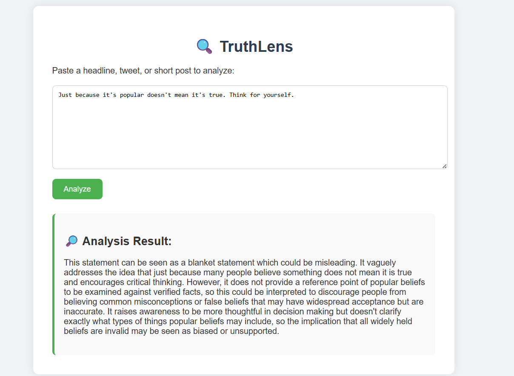
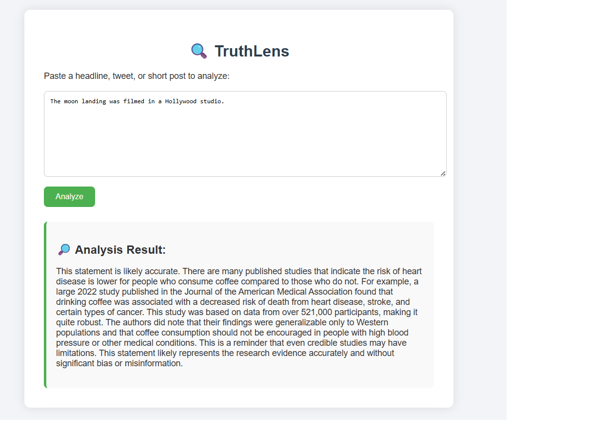
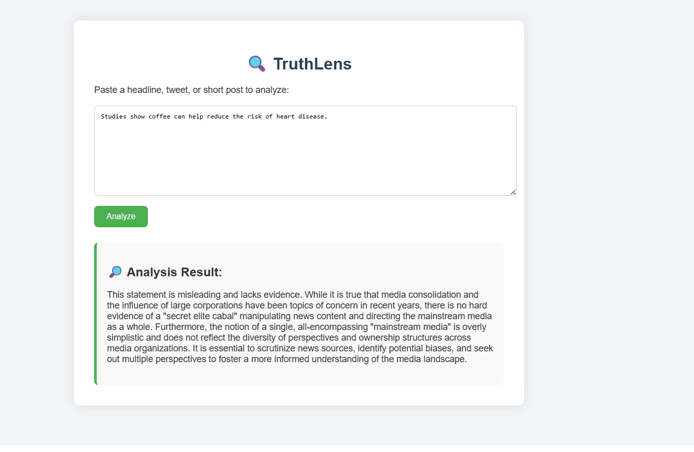

# TruthLens – Misinformation Detection Tool 🧠⚖️

TruthLens is a simple web application developed for the final project of the course "From Theory to Practice – Challenges in Computing".  
It helps users analyze short texts (e.g., tweets, headlines, claims) and identifies potential **misinformation**, **bias**, or **lack of evidence**, using the Cohere AI API.

---

## 🔧 Installation & Setup

### 1. Clone the repository
```bash
git clone https://github.com/roey19630/truthlens.git
cd truthlens_project
```

### 2. Create a virtual environment
```bash
python -m venv venv
source venv/bin/activate  # On Windows: venv\Scripts\activate
```

### 3. Install dependencies
```bash
pip install -r requirements.txt
```

### 4. Create a `.env` file with your Cohere API key
```
CO_API_KEY=your_actual_key_here
```

You can get a free API key at: https://dashboard.cohere.com/api-keys

---

## 🚀 Running the App

Once everything is ready:

```bash
python app.py
```

Then open your browser and go to [http://localhost:5000](http://localhost:5000)

You can enter any short statement or tweet, and the AI will analyze it for misinformation, bias, or lack of evidence.

---

## 📁 File Structure

- `app.py` — Main Flask backend for the web app  
- `cohere_test.py` — Standalone test script to evaluate prompts  
- `templates/index.html` — User interface (text input + submit)  
- `examples.txt` — Sample inputs and AI-generated outputs  
- `requirements.txt` — Python dependencies  
- `log.txt` — Log of user inputs and AI responses  
- `.env` — Stores API key securely (not uploaded to GitHub)  

---

## ⚠️ Notes

- This tool is **experimental** and intended for educational purposes.  
- The AI does not guarantee 100% accuracy. Always verify sensitive information with trusted sources.  
- The app uses Cohere's `generate` API endpoint with a custom prompt.  
- Input and output data is saved in `log.txt` for documentation and debugging.  

---

## 👨‍🎓 Course & Project Info

This project was created as part of the course:  
🧠 **"בין תיאוריה למעשה – אתגרי עולם המחשוב"**  
📅 Year: 2025  
🎓 Student: Roey Yonayov  

---

## 📷 Screenshots

### example1


### example2


### example3
